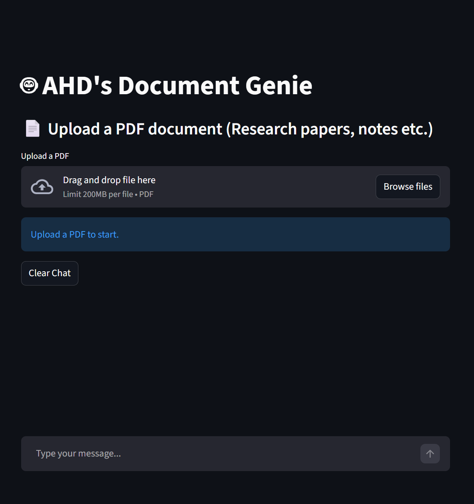
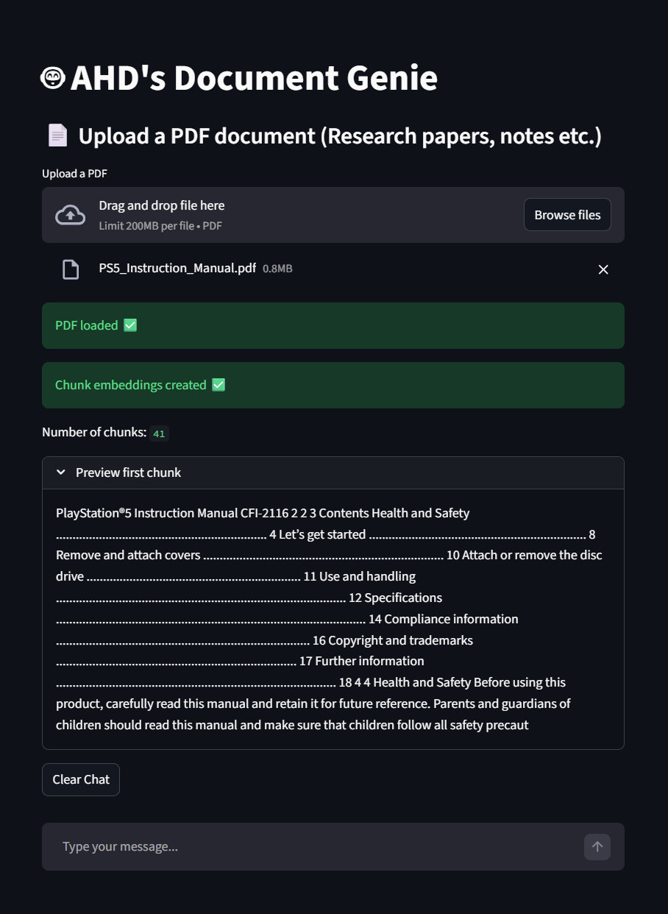
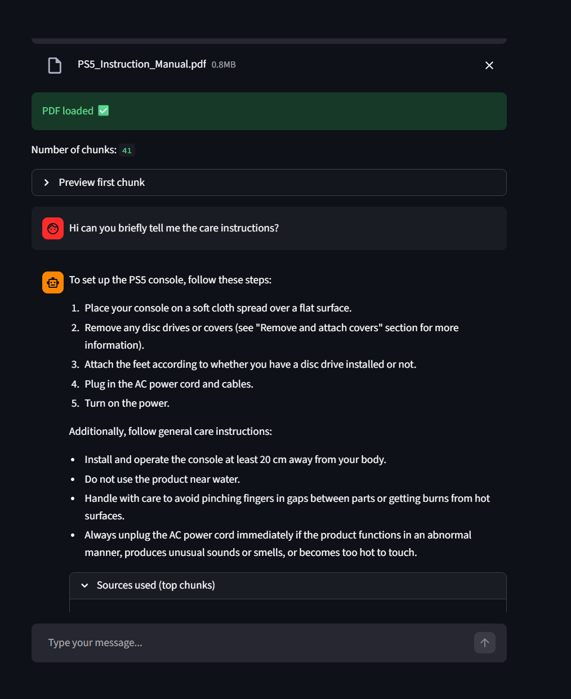
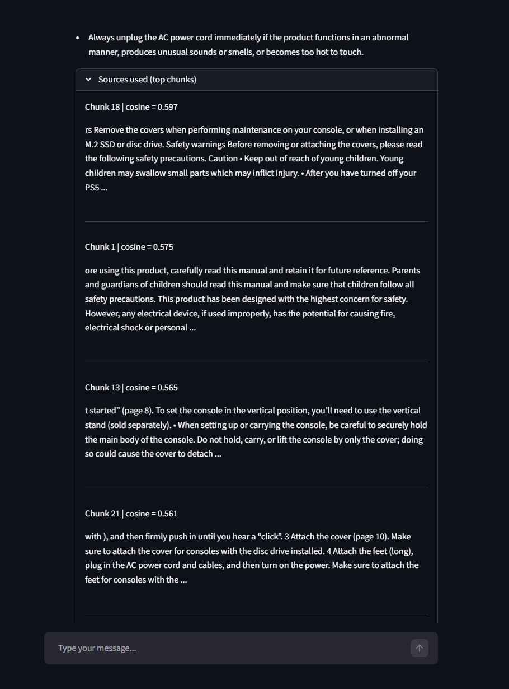

# AHD's Document Genie

A local Retrieval-Augmented Generation (RAG) chatbot that lets users upload a PDF and ask questions about its contents.

This project uses **Streamlit**, **Ollama**, local embeddings, and cosine similarity search to retrieve relevant document chunks before generating an answer. The goal was to build a complete local document question-answering pipeline rather than just call an LLM directly.

---

## Demo Video

https://github.com/user-attachments/assets/73540ba6-1b79-4cf6-b1c3-dfc7ed51fb9f

---

## Overview

AHD's Document Genie is a PDF-based chatbot that answers questions using the contents of an uploaded document. After a PDF is uploaded, the app extracts its text, splits it into overlapping chunks, creates embeddings for each chunk, retrieves the most relevant chunks for a user query, and passes those chunks to a local LLM through Ollama.

The app runs locally, which means the document is processed on the user's machine instead of being sent to a cloud API. This makes the project useful for experimenting with private document question-answering and understanding the core mechanics behind RAG systems.

---

## Demo

The app starts with a simple Streamlit interface where the user can upload a PDF document.



After uploading a PDF, the document is processed and split into searchable chunks.



The user can then ask questions about the document. The app retrieves the most relevant chunks and uses them as context for the local LLM response.



The app also shows the retrieved source chunks, which helps make the answer more transparent.



---

## Features

- PDF upload through a Streamlit interface
- PDF text extraction
- Chunking with overlap to preserve context
- Local embedding generation using Ollama
- Cosine similarity retrieval
- Top-k relevant chunk selection
- Context injection into the LLM prompt
- Local LLM response generation using `llama3.2:3b`
- Source chunk display for transparency
- Session state caching to avoid unnecessary reprocessing

---

## Tech Stack

- **Python**
- **Streamlit** for the web interface
- **Ollama** for local LLM and embedding models
- **llama3.2:3b** for answer generation
- **nomic-embed-text** for embeddings
- **NumPy** for vector operations
- **pypdf** for PDF text extraction
- **requests** for communicating with the local Ollama server
- **Cosine similarity** for retrieval

---

## How It Works

The project follows a standard RAG pipeline:

```text
PDF Upload
   ↓
Text Extraction
   ↓
Chunking with Overlap
   ↓
Embedding Generation
   ↓
Query Embedding
   ↓
Cosine Similarity Search
   ↓
Top-k Context Retrieval
   ↓
Prompt Construction
   ↓
Local LLM Response
   ↓
Answer + Source Chunks
```

Instead of sending the entire PDF to the model, the system retrieves only the most relevant chunks and includes them in the prompt. This helps the model answer based on the uploaded document rather than relying only on its general knowledge.

---

## Project Structure

```text
rag-document-genie/
│
├── app.py
├── rag_utility.py
├── embeddings_utility.py
├── requirements.txt
├── README.md
│
└── screenshots/
    ├── app_home.png
    ├── pdf_uploaded.png
    ├── answer_with_sources_1.png
    └── answer_with_sources_2.png
```

---

## Main Files

### `app.py`

Contains the Streamlit user interface and the main app flow. It handles PDF upload, stores processed chunks and embeddings in `st.session_state`, accepts user questions, retrieves relevant chunks, and sends the final prompt to the local LLM.

### `rag_utility.py`

Contains helper functions for PDF processing and chunking. It extracts text from PDF pages and splits the text into overlapping chunks so that context is not lost between sections.

### `embeddings_utility.py`

Handles embedding generation and similarity search. It sends text to Ollama's embedding endpoint, receives vector embeddings, computes cosine similarity, and returns the top matching chunks.

---

## Local Setup

This project requires Ollama because both the LLM and embedding model run locally.

### 1. Install Ollama

Download and install Ollama from:

```text
https://ollama.com
```

### 2. Pull the required models

Run these commands:

```bash
ollama pull llama3.2:3b
ollama pull nomic-embed-text
```

### 3. Start Ollama

Usually Ollama runs automatically in the background. If needed, start it manually:

```bash
ollama serve
```

You can check if Ollama is running by opening:

```text
http://localhost:11434
```

If it is working, it should show that Ollama is running.

### 4. Create a virtual environment

```bash
python -m venv .venv
```

Activate it on Windows PowerShell:

```bash
.venv\Scripts\Activate.ps1
```

If PowerShell blocks activation, use:

```bash
.venv\Scripts\activate
```

or run the app from a terminal where the virtual environment is already active.

### 5. Install dependencies

```bash
pip install -r requirements.txt
```

### 6. Run the app

```bash
streamlit run app.py
```

The app will open locally at:

```text
http://localhost:8501
```

---

## Example Usage

1. Start Ollama.
2. Run the Streamlit app.
3. Upload a PDF, such as notes, a manual, or a research paper.
4. Wait for the PDF to load and for embeddings to be created.
5. Ask a question about the document.
6. View the answer and expand the sources section to see which chunks were retrieved.

Example questions:

```text
What is the main idea of this document?
```

```text
Summarize the important points from chapter 2.
```

```text
What does the document say about system requirements?
```

```text
Explain this section in simpler words.
```

---

## Why This Project Runs Locally

This project uses Ollama through:

```text
http://localhost:11434
```

That means the LLM and embedding model run on the user's own machine. This is useful because uploaded documents do not need to be sent to an external API.

Because of this local setup, the app is not deployed as a public website in its current version. To deploy it online, the Ollama-based LLM and embedding calls would need to be replaced with a hosted API or Ollama would need to be hosted on a server.

---

## Notes on Deployment

The current version is designed for local use. A public deployment would require one of the following:

- replacing Ollama with a hosted LLM API
- replacing local embeddings with a hosted embedding model
- hosting Ollama on a cloud server
- using a smaller model supported directly by the deployment platform

For this version, I chose the local approach because it makes the project privacy-friendly and allows the full RAG pipeline to run without paid API calls.

---

## Issues Faced and What I Learned

One of the main challenges was understanding that a RAG chatbot is not just an LLM answering questions. The retrieval pipeline matters a lot. The PDF has to be extracted properly, split into useful chunks, embedded, searched, and then passed to the model in a way that gives enough context without overwhelming it.

I also had to handle Streamlit reruns. Since Streamlit reruns the script whenever the user interacts with the app, I used `st.session_state` to avoid reprocessing the same PDF again and again. This made the app more practical and responsive.

Another issue was working with local Ollama endpoints. If Ollama is not running, the app cannot generate embeddings or answers. This helped me understand how local model servers work and how the frontend app communicates with backend model endpoints.

This project gave me a clearer understanding of how modern document QA systems are built: the quality of the answer depends not only on the LLM, but also on chunking, embeddings, retrieval, and prompt construction.

---

## Limitations

This is a local RAG prototype, not a production-grade document assistant.

Some limitations include:

- It depends on Ollama running locally.
- It currently supports PDF files only.
- Retrieval quality depends on the chunk size and overlap.
- Very long or poorly formatted PDFs may produce weaker results.
- The app does not currently provide page-level citations.
- The app is not currently deployed publicly because it depends on local Ollama.

---

## Future Work

Possible improvements include:

- adding support for multiple PDFs
- ability to upload images as well
- improving chunking with section-aware or paragraph-aware splitting
- adding page number references for retrieved chunks
- supporting additional file types such as DOCX and TXT
- adding a hosted deployment version using an API-based LLM
- adding persistent chat history, exportable conversations, and document summaries
- allowing users to choose the number of retrieved chunks
- adding evaluation tests for retrieval quality

---

## Requirements

The main Python requirements are:

```text
streamlit
pypdf
requests
numpy
```

Ollama must also be installed separately.

---

## Summary

AHD's Document Genie is a local PDF question-answering chatbot built to demonstrate a complete RAG workflow. It combines PDF processing, text chunking, local embeddings, cosine similarity retrieval, prompt construction, and local LLM generation into a working Streamlit application.

The project helped me understand how retrieval-based AI applications work beyond simple chatbot interfaces, especially the importance of preprocessing, embeddings, retrieval quality, and local model serving.
